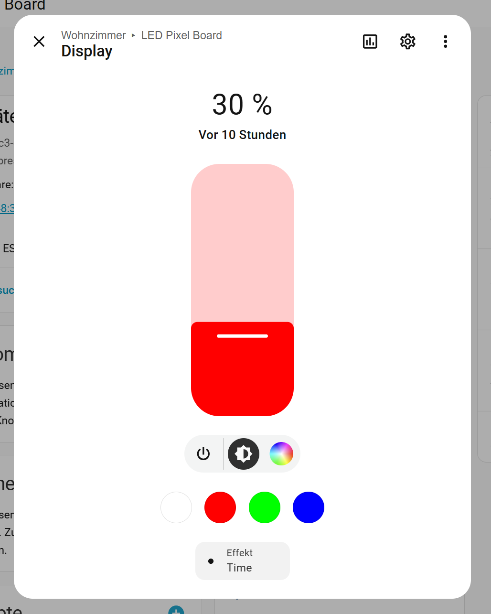

## EESPHome integration for a LED Pixel Board

### How to integrate into HomeAssistant

When this external component is compiled and uploaded to the esp32 module you hopefully get a message on your Hoeassistant instance about a new ESPHome device detectet. Allow to import it. The device page will show up as follows.


### The internal components explained

- **Animation Mode** (number 0-9, default: 1)   
  exlusive for the Message effect. Animation Speed does apply.
  
  0: text is displayed in pages   
  1: text scrolling from right to left   
  2: text scrolling from left to right   
  3: text scrolling from bottom to top   
  4: text scrolling from top to bottom  
  5: text flashing   
  6: text with brightnes fading in and out  

- **Animation Speed** (number 1-100, step: 1, default: 100)   
  exlusive for the Message effect

- **Clock Style** (number 1-9, default: 7)   
  exlusive for the Time and Time & Date effect
  Same styles as selectable in the iPixel Color App 

- **Text or Image URL** (text input)   
  text input for the Message effect and loading images.
  this input has some features by seaching for an extension (usefull for scripting):
  if none of the following extensions is detected the text string is set.
  - '.bmp' interpeteed as URL to a bmp image (gets rezized)
  - '.png' interpeteed as URL to a png image (gets rezized)
  - '.jpg' interpeteed as URL to a jpg image (gets rezized)
  - '.gif' interpeteed as URL to a gif image (has to fit the dizplay dimensions!)
  - '.png' interpeteed as URL to a png image
  - '.img' the preceding number setz the Tmage Slot slider
  - '.col' the preceding list of mumbers sets the drawing color for text (e.g. "red green blue.col", "255 255 255.col" is white) 
  - '.bgc' same as .col but used a backgrount color of the text
  - '.lst' the preceding list of space separated mumbers sets the slots for the program feature
  - '.del' the preceding list of space separated mumbers sets the slots to be cleared

- **Program List**
  The switch returns to off as log ther has no program list has been set before (e.g. "1 2 3.lst).
  if there is valid program list available set the switch to on and provide the animations to be loaded to the program slots
  until the Proram Slot sensor shows 0 again. 
  Example: key in into the Text or Image URL field
    <URL>.gif<return> loads a gif image
    This text shall follow the animation.<return>
    And now the porgram is at its end.<return>
  Now the Programm feature displays all provided commands in a sequence. The program will be stpped on anything loaded to slot 0 afterwards.
  This may be selecting control light effects or keying in other commands. 

- **Control** (rgb light)   
  First of all you can switch on and off the display;)
  Cliking on the text "Display" will open the rgb light dialog (see next chapter)

  Effects:
  - **None** calls the clear() method which shows the inintial image of the device  
  - **Time** displays an internal clock frame  
  - **Time & Date** display alternating clock and date  
  - **Message** display text  
  - **Load Image** select the source via the Image Slot slider
  - **Fill Color** fills the entire display with the current color  
  - **Fill Rainbow** loads an image with diagonal rainbow colors  
  - **Rhythn Animation** set the style via the Image Slot slider
  - **Rhythm Levels** set the style via the Image Slot slider  
  - **Random Pixel** calls the setPixel() method with random coordinates and colors every 300ms  
  - **Alarm** changes brightness in a falling ramp every 300ms  

- **Font Flag** (number 1-4, default: 0)  
  exlusive for the Message effect
  
  0:  8x16 Font  
  0:  8x16 Font   
  1: 16x16 Font   
  2: 16x32 Font   
  3:  8x16 Font (encoded with width and height parameters per char, not compatible with my display)   
  4: 16x32 Font (encoded with width and height parameters per char, not compatible with my display)   

- **Text Mode** (number 0-4, default: 0)
  exlusive for the Message effect
  
  0: text color taken from the rgb light color   
  1: Text color white   
  2: top to bottom rainbow effect (yellow to red)   
  3: top to bottom rainbow effect (light blue to white)   
  4: top to bottom rainbow effect (blue to yellow)   
  
- **Update Time**
  Usually the internal clock of the display gets synchronized every hour by this device based on the homaassistant time (requires ipixel-ble.yaml time entry at the end of the file). If, for what reasons ever, the time is not up to date press this button. If it is still not correct soemting is wrong with your Homeassistant time. 
 
### The display rgb light component explained

Click on the text "Control" of the RGB light component to open detailed settings. Here you can set brightness, color and select effects.




### HomeAssistant scripting

You can put images to the /config/www folder and access them via the URL http://<HA IP>:8123/local/...  

Example for an animation:
```
alias: LED Pixel Stripe Meldung
description: ""
triggers:
  - trigger: state
    entity_id:
      - input_text.meldung
conditions: []
actions:
  - action: script.led_pixel_stripe
    data:
      message: "{{ states('input_text.meldung') | string }}"
      url: http://192.168.0.254:8123/local/images/64x20/gif/animated/tetris2.gif
mode: single
```

Example for displaying a program list script:
```
alias: LED Pixel Stripe
description: Meldung auf LED Pixel Stripe ausgeben
mode: single
fields:
  message:
    name: Meldung
    description: message to display
    selector:
      text: null
    default: ""
  url:
    name: Bild
    description: image to display
    selector:
      text: null
    default: ""
sequence:
  - if:
      - condition: template
        value_template: "{{ message | string != '' }}"
    then:
      - action: switch.turn_off
        data:
          entity_id: switch.led_pixel_stripe_program_list
      - action: light.turn_on
        data:
          brightness_pct: 100
          effect: None
        target:
          entity_id: light.led_pixel_stripe_control
      - action: number.set_value
        target:
          entity_id: number.led_pixel_stripe_annimation_speed
        data:
          value: "100"
      - action: text.set_value
        data:
          value: 255 0 0.col
        target:
          entity_id: text.led_pixel_stripe_text_or_image_url
      - if:
          - condition: template
            value_template: "{{ url | string == '' }}"
        then:
          - action: text.set_value
            data:
              value: 1.lst
            target:
              entity_id: text.led_pixel_stripe_text_or_image_url
          - action: switch.turn_on
            data:
              entity_id: switch.led_pixel_stripe_program_list
          - action: text.set_value
            data:
              value: "{{ message | string }}"
            target:
              entity_id: text.led_pixel_stripe_text_or_image_url
        else:
          - action: text.set_value
            data:
              value: 1 2.lst
            target:
              entity_id: text.led_pixel_stripe_text_or_image_url
          - delay: "00:00:01"
          - action: switch.turn_on
            data:
              entity_id: switch.led_pixel_stripe_program_list
          - action: text.set_value
            data:
              value: "{{ message | string }}"
            target:
              entity_id: text.led_pixel_stripe_text_or_image_url
          - wait_template: "{{ states('sensor.led_pixel_stripe_upload_queue') | int == 0 }}"
            continue_on_timeout: true
            timeout: "00:00:10"
          - action: text.set_value
            data:
              value: "{{ url | string }}"
            target:
              entity_id: text.led_pixel_stripe_text_or_image_url
          - wait_template: "{{ states('sensor.led_pixel_stripe_upload_queue') | int == 0 }}"
            continue_on_timeout: true
            timeout: "00:00:10"
    else:
      - action: light.turn_on
        target:
          entity_id: light.led_pixel_stripe_control
        data:
          effect: Time
          brightness_pct: 20
```
